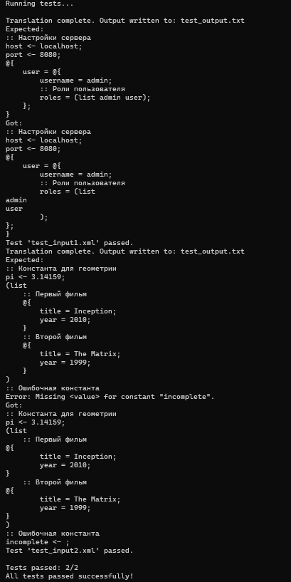

Задание №3 
- Разработать инструмент командной строки для учебного конфигурационного языка, синтаксис которого приведен далее. Этот инструмент преобразует текст из входного формата в выходной.
- Синтаксические ошибки выявляются с выдачей сообщений.
- Входной текст на языке xml принимается из стандартного ввода. Выходной текст на учебном конфигурационном языке попадает в стандартный вывод.  

Ниже синтаксис учебного языка
- Однострочные комментарии:
  - :: Это однострочный комментарий 
- Массивы: 
  - (list значение значение значение ... ) 
- Словари: 
  - @{     
      имя = значение;      
      имя = значение;     
      имя = значение;     
  ...     
} 
- Имена: 
  - [a-zA-Z]+ 
- Значения: 
  - Числа. 
  -  Массивы. 
  -  Словари. 
- Объявление константы на этапе трансляции: 
  - имя <- значение; 
- Вычисление константы на этапе трансляции: 
  - $имя$

 
- Результатом вычисления константного выражения является значение. Все конструкции учебного конфигурационного языка (с учетом их возможной вложенности) должны быть покрыты тестами. Необходимо показать примера описания конфигураций из разных предметных областей.

Transform.py переводит с языка xml на учебный конфигурационный язык через парсинг .xml файла и тэгов. Ниже приведены 2 примера в формате БЫЛО/СТАЛО          
test_input1.xml >

```xml
<config>
    <comment> Настройки сервера</comment>
    <constant name="host">
        <value>localhost</value>
    </constant>
    <constant name="port">
        <value>8080</value>
    </constant>
    <dict>
        <entry name="user">
            <dict>
                <entry name="username">
                    <value>admin</value>
                </entry>
                <comment> Роли пользователя</comment>
                <entry name="roles">
                    <list>
                        <value>admin</value>
                        <value>user</value>
                    </list>
                </entry>
            </dict>
        </entry>
    </dict>
</config>
```

test_output1.txt >
```txt
:: Настройки сервера
host <- localhost;
port <- 8080;
@{
    user = @{
        username = admin;
        :: Роли пользователя
        roles = (list admin user);
    };
}
```
 
и второй пример

test_input2.xml >
```xml
<config>
    <comment> Константа для геометрии</comment>
    <constant name="pi">
        <value>3.14159</value>
    </constant>
    <list>
        <comment> Первый фильм</comment>
        <dict>
            <entry name="title">
                <value>Inception</value>
            </entry>
            <entry name="year">
                <value>2010</value>
            </entry>
        </dict>
        <comment> Второй фильм</comment>
        <dict>
            <entry name="title">
                <value>The Matrix</value>
            </entry>
            <entry name="year">
                <value>1999</value>
            </entry>
        </dict>
    </list>
    <comment> Ошибочная константа</comment>
    <constant name="incomplete">
        <!-- Пропущен <value> -->
    </constant>
</config>
```

test_output2.txt >
```txt
  :: Константа для геометрии
pi <- 3.14159;
(list 
    :: Первый фильм
    @{
        title = Inception;
        year = 2010;
    } 
    :: Второй фильм
    @{
        title = The Matrix;
        year = 1999;
    }
)
:: Ошибочная константа
Error: Missing <value> for constant "incomplete".
```

Ниже приведены скриншоты успешных тестов, покрывающийх полный функционал учебного конфигурационного языка:


